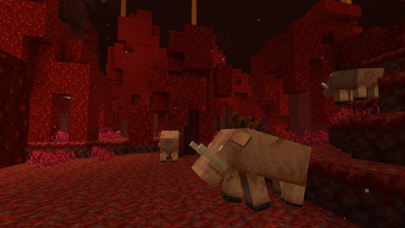

+++
title = "La Submonda Ĝisdatiĝo Finfine Alvenis!"
date = 2020-06-25
slug = "submonda-gxisdatigo"
extra.auxtoro = "Ver3ndo"
extra.bildo = "infero.jpeg"
+++

_Notiĝu: Je la tempo de skribado, la servilo ankoraŭ uzas 1.15.2. **Espera-Mondo.net ekuzos Minecraft 1.16 je la 1a de Julio, 2020**._

Estas feliĉiga diri, ke la plej lasta versio de Minecraft, nomita la Submonda Ĝisdatiĝo, nun finfine estas ludebla! Ĉi tiu estas unu el la plej grandaj Minecraft ĝisdatiĝoj iam ajn, aparte pri la Submondo (Infero), kiu estis tute redesegnita. Tial, ĝi enhavas tro da ŝanĝiĝoj por plene priskribi ĉi tie; malgraŭ tio, jen kelkaj el la plej gravaj ŝanĝigoj:

- La infero nun havas 4 novajn biomojn: _bazalta delto_, _karmezina arbaro_, _kurbigita arbaro_, kaj _animsabla valo_, krom la originala infera biomo, la _infera rubaĵejo_.
- Zombiaj porkuloj ne plu ekzistas, tamen estas 4 novaj inferaj bestoj:
    -    _Piglino_ (porkkoboldo), kiu atakas ludantojn sen incito. Tamen, oni povas pacigi piglinojn per oraj ingotoj.
    -    _Zombia piglino_ (zombia porkkoboldo), simile kiel zombiporkulo.
    -    _Hoglino_ (fakoĥero), granda porkeca besto bildigita supre. Hoglinoj ankaŭ atakas sen incito, kaj siaj atakoj estas tre potencaj.
    -    Lafo-paŝanto (“strider” angle), besto kiu povas marŝi tra lafo. Ludantoj povas rajdi sur lafo-paŝantoj por transiri lafon. 
-    Nun eblas ŝanĝi onian aperigan lokon en la Infero, per nova bloko nomita _reaperankro_. Tiuj ankroj nur funkcias en la Infero; fakte, ĝi eksplodiĝas en la Supramondo kaj la Finejo, do zorgu tion.
-    Estas nun materialo pli forta ol diamanto: _inferito_. Inferito akireblas per la minado kaj kuirado de _antikva rubo_, kombinita kun oraj ingotoj. Antikva rubo nur troviĝas ĉe la plej subaj niveloj de la Infero.

Pro la grandega kvanto da ŝanĝiĝoj en ĉi tiu ĝisdatiĝo, la malnova Infera mondo estos forigita post kiam Espera-Mondo.net ekuzas Minecraft 1.16. Tio signifas, ke ĉiuj portaloj estos rompitaj, kaj ke ĉiuj nunaj konstruaĵoj/farmoj nune en la Infero estos rompitaj, kaj devos esti rekonstruitaj.

Se vi havas demandojn aŭ komentojn pri la ĝisdatiĝo, bonvolu kontaktu min per la ligiloj sube.
